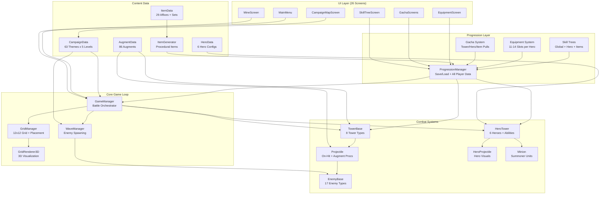
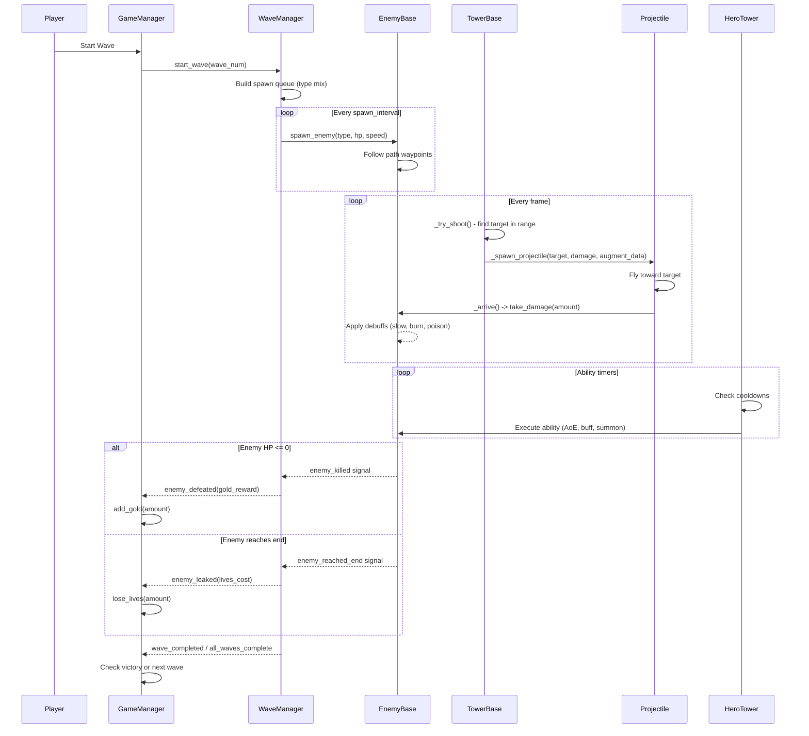
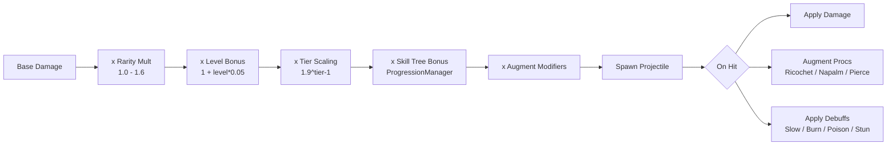
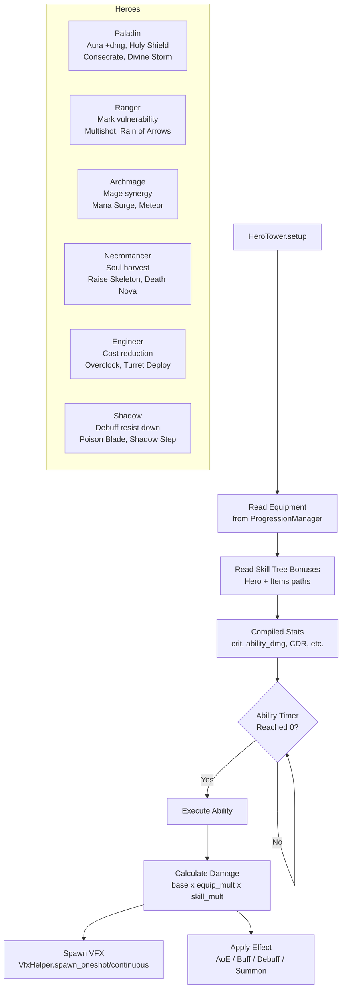
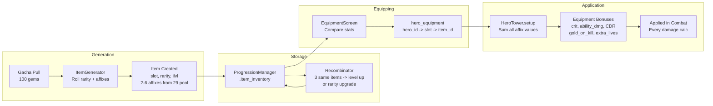
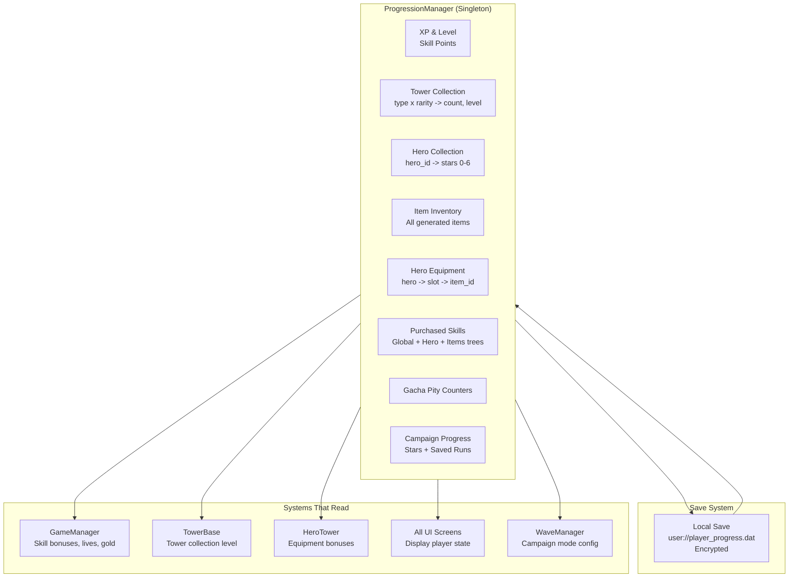
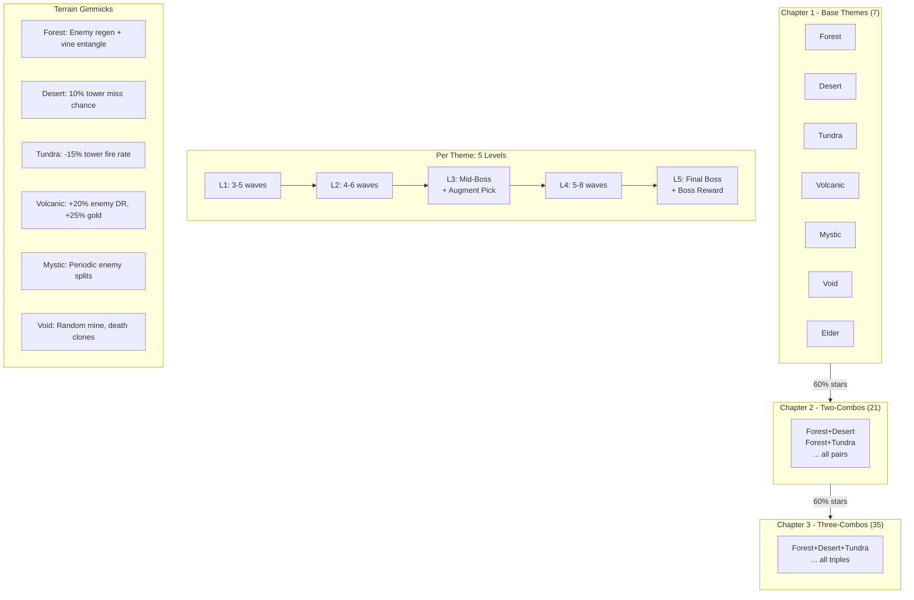
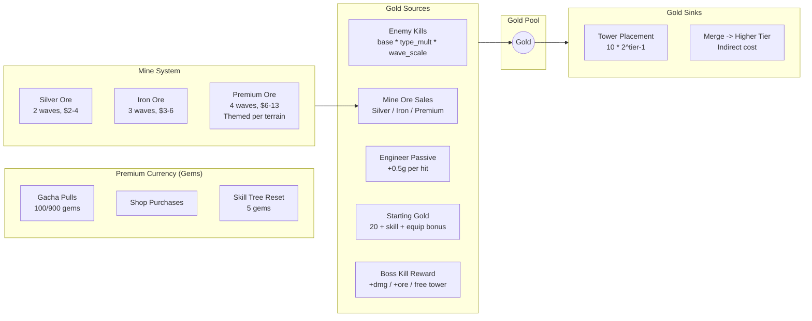
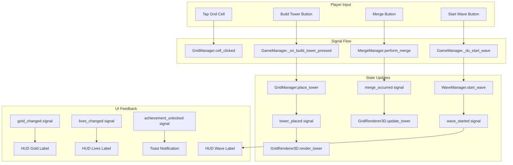

# Triforge TD - System Architecture

> Godot 4 tower defense with merge-2 upgrading, hero abilities, augment system, and gacha progression.
> Mobile-first (768x1280 portrait). ~39k lines of GDScript across 56 files.

---

## High-Level System Overview



---

## Battle Data Flow

The core gameplay loop from wave start to enemy death:



---

## Tower Damage Pipeline



### Tower Types & Specializations

| Tower | Mechanic | Key Augments |
|-------|----------|-------------|
| Archer | Single target, fast | Ricochet (bounce), Poison Quiver (DoT) |
| Cannon | Splash AoE | Grapeshot (cone), Napalm (fire zone) |
| Mage | Chain bounce | Arcane Orb (pierce), Spell Echo (repeat) |
| Sniper | High single damage | Reload (charge up), Headshot (execute) |
| Frost | Freeze AoE | Glacial Aura (zone), Permafrost (stack) |
| Laser | Continuous beam | Pulse Mode (rapid), Overcharge (ramp) |
| Summoner | Spawn minions | Soul Harvest (on-kill), Swarm (count) |
| Poison | Cloud AoE | Toxic Cloud (persist), Plague (spread) |

---

## Hero Ability Pipeline



---

## Equipment & Item Flow



### Affix Categories

| Category | Affixes |
|----------|---------|
| **Offense** | flat_damage, pct_damage, atk_speed, crit_chance, crit_damage, boss_damage |
| **Ability** | ability_damage, cooldown_red, ability_duration, ability_area |
| **Debuff** | debuff_duration, slow_effect, dot_damage, dot_tick_speed |
| **Proc** | pierce_chance, stun_chance, multi_hit, splash_damage, splash_radius |
| **Summon** | summon_damage, aura_range |
| **Economy** | ore_yield, xp_bonus, gold_on_kill, gold_per_wave, starting_gold, extra_lives |
| **Tower** | tower_damage, pct_range |

---

## Progression & Persistence



### Skill Tree Paths (5 tabs)

```
GOLD -------- Tower cost reduction, starting gold, gold per wave, gold on kill
TOWER ------- Damage, attack speed, range, crit for all tower types
DEFENSE ----- Extra lives, enemy slow, damage reduction
MINE -------- Ore yield, mine slots, auto-deploy, premium ore bonuses
ITEMS ------- Equipment stat boosts + 3 keystone nodes unlock Ring slots 3/4/5
```

---

## Campaign Structure



### Augment Pick Schedule

| Chapter | Picks | Levels |
|---------|-------|--------|
| Ch1 | 2 | L1, L3 |
| Ch2 | 3 | L1, L3, L4 |
| Ch3 | 4 | L1, L3, L4, L5 |

Later picks offer L6 upgrades of already-chosen augments (weighted).

---

## Economy Flow



---

## Signal & Event Architecture



---

## File Dependency Map

```
game_manager.gd (5,670 lines) ─── Master orchestrator
  ├── GridManager ─── 12x12 grid, cell types, coordinate conversion
  │   └── GridRenderer3D ─── 3D terrain + tower mesh rendering
  ├── WaveManager ─── Wave spawning, enemy queue, boss cycling
  ├── MergeManager ─── 2-merge system (2 towers -> 1 higher tier)
  ├── HeroTower ─── Hero placement + ability dispatch
  ├── TowerBase (3,744 lines) ─── 8 tower types, targeting, augment checks
  │   ├── Projectile (1,507 lines) ─── Flight, on-hit, augment procs
  │   └── Minion ─── Summoner-spawned units
  ├── EnemyBase (1,812 lines) ─── 17 enemy types, debuffs, death procs
  └── ProgressionManager (3,100 lines) ─── All persistent player data
      ├── ItemData ─── Enums, affix pools, set definitions
      ├── ItemGenerator ─── Procedural item generation
      ├── HeroData ─── 6 hero config dicts
      ├── AugmentData (1,388 lines) ─── 86 augment definitions
      ├── CampaignData ─── 63 themes, gimmicks, level scheduling
      └── GachaData ─── Pull rates, pity, rarity scaling
```

---

## Tech Stack

| Component | Technology |
|-----------|-----------|
| Engine | Godot 4.x |
| Language | GDScript |
| Rendering | 3D (Forward+) |
| Target | Mobile (Android/iOS), 768x1280 portrait |
| Save System | Encrypted local file (AES) |
| Audio | SfxManager singleton, .ogg/.wav |
| VFX | Custom particle scenes + Binbun VFX pack |
| Models | KayKit character/weapon packs, custom .glb |
| Analytics | Firebase |
| Ads | AdMob |
| Auth | Firebase Authentication |
